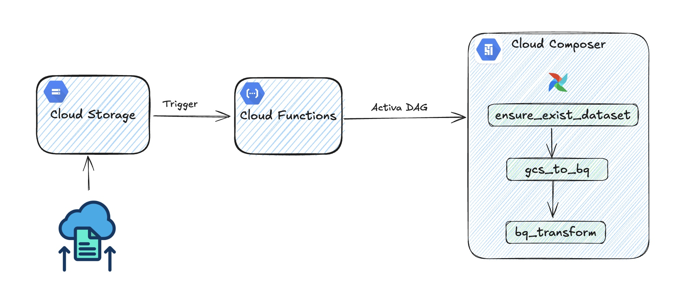
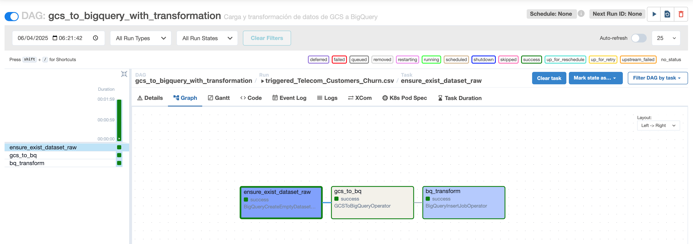

# Konexa Test - Data Engineer

Este proyecto es una solución integral para una prueba técnica de ingeniería de datos. La solución aborda tres requerimientos principales mediante una arquitectura basada en eventos:

## 🧩 Objetivo

1. Procesar automáticamente un archivo cuando se carga a un bucket en GCS.
2. Desplegar automáticamente una Cloud Function para manejar el procesamiento.
3. Ejecutar un DAG en Cloud Composer para cargar el archivo en BigQuery y aplicar una transformación.

---

## ⚙️ Arquitectura de la solución

La solución implementa una **arquitectura orientada a eventos** que cubre las tres preguntas:




1. ✅ **Subida de archivo a GCS**  
   Dispara un evento que activa una Cloud Function.

2. 🚀 **Cloud Function (Event Trigger)**  
   La función obtiene los metadatos del archivo y lanza un DAG en Cloud Composer con los datos del evento.

3. 📈 **DAG en Composer (Airflow)**  
   El DAG:
   - Asegura la existencia del dataset en BigQuery.
   - Carga el archivo desde GCS a BigQuery.
   - Ejecuta una transformación SQL directamente sobre los datos cargados.


   

---

## 📁 Estructura del proyecto


---

## 🛠️ Tecnologías usadas

- **Google Cloud Platform (GCP)**  
  - Cloud Functions  
  - Cloud Storage  
  - BigQuery  
  - Cloud Composer (Airflow)

- **Terraform** — Para Infraestructura como Código  
- **GitHub Actions** — Para CI/CD automatizado  
- **Python** — Lógica de Cloud Function y DAG

---

## 🚀 Despliegue en otros proyectos

1. Clonar el repositorio y configurar credenciales GCP (Es necesario contar con una cuenta de servicio con los permisos necesarios para desplegar los servicios y guardarla como secreto con el nombre GCP_CREDS).
2. Editar las variables de entorno del pipeline PROJECT_ID y REGION. Además teber en cuenta las variables en variables.tf de la raiz infrasctructure para evitar conflicto con el nombre de los buckets.
3. Ejecutar los comandos de Terraform (Tener en cuenta que se deben tener habilitadas las API de GCS, Eventract, Cloud Functios, Composer):
   ```bash
   cd infrastructure
   terraform init
   terraform apply
4. Para probar el despligue atomatico, se tendría que hacer un cambio en el DAG, en el código main de función o algun script dentro de infrastructure. 
    ```bash
   git add .
   git commit -m"Prueba de despligue automatizado"
   git push origin main


5. Para probar el flujo de los datos, se tendría que subir un archivo al bucket source y esperar a que se termine de ejecutar el dag para visualizar los datos transformados en bigquery.