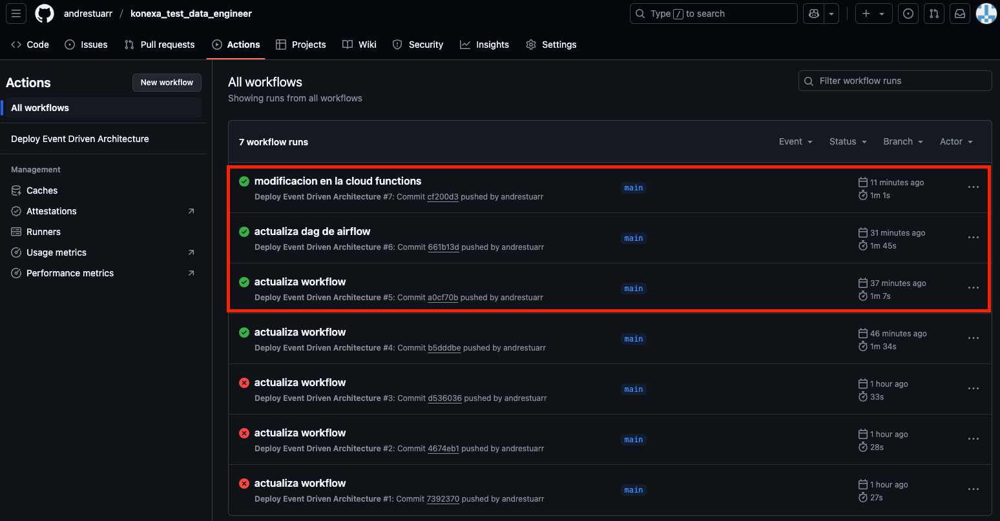
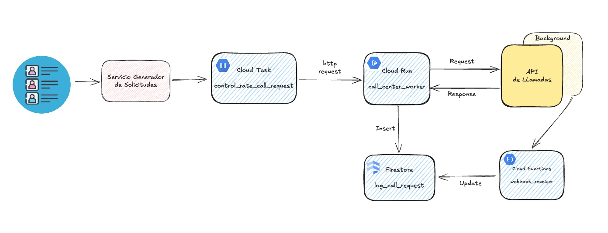

# Konexa Test - Data Engineer

Este repositorio presenta una solución integral para una prueba técnica de **Ingeniería de Datos**, basada en una **arquitectura orientada a eventos** en Google Cloud Platform. La solución aborda tres requerimientos clave mediante el uso de Terraform, Cloud Functions, Composer (Airflow) y BigQuery.

---

## 🎯 Objetivo

1. Detectar automáticamente la carga de un archivo en un bucket de GCS.
2. Ejecutar una Cloud Function que reaccione al evento.
3. Lanzar un DAG en Cloud Composer que importe el archivo en BigQuery y realice una transformación de datos.

---

## ⚙️ Arquitectura de la solución

Se implementa una **arquitectura event-driven** (basada en eventos) que automatiza completamente el procesamiento del archivo:


### Flujo:

1. ✅ **Carga de archivo a GCS**  
   Un archivo `.csv` es subido manual o automáticamente a un bucket de Cloud Storage, lo que genera un evento.

2. 🚀 **Cloud Function (trigger por evento)**  
   La función se activa por el evento, extrae los metadatos del archivo y lanza un DAG en Composer, pasando los parámetros necesarios.

3. 📈 **DAG en Cloud Composer (Airflow)**  
   El DAG realiza las siguientes acciones:
   - Verifica o crea el dataset en BigQuery.
   - Carga el archivo desde GCS a una tabla temporal en BigQuery.
   - Aplica una transformación SQL para tipificar correctamente los datos y almacenarlos en una tabla final.


---

## 📁 Estructura del proyecto

```plaintext
├── cloud_functions/            # Código de la Cloud Function
│   └── main.py
|   └── requirements.txt
│
├── composer/                   # DAG de Airflow
│   └── dag_process.py
│
├── infrastructure/             # Infraestructura como código (Terraform)
│   ├── modules
│   │    ├── cloud_functions
│   │    ├── cloud_storage
│   │    ├── composer
│   │    └── iam
|   ├── main.tf
│   ├── variables.tf
│   ├── providers.tf
│   └── outputs.tf
│
└── imagenes/                   # Diagramas explicativos
    ├── arquitectura.jpg
    └── dag.png
```


---

## 🛠️ Tecnologías utilizadas

- **Google Cloud Platform (GCP)**  
  - Cloud Storage  
  - Cloud Functions  
  - Cloud Composer (Apache Airflow)  
  - BigQuery  

- **Terraform** — Infraestructura como código  
- **GitHub Actions** — Automatización del CI/CD  
- **Python** — Lógica de la Cloud Function y el DAG

---

## 🚀 Despliegue en otro proyecto

1. **Clonar este repositorio** y configurar las credenciales de GCP.  
   Debes contar con una cuenta de servicio con permisos para desplegar recursos (Storage, Functions, Composer, etc.). Guarda el JSON como secreto en GitHub con el nombre `GCP_CREDS`.

2. **Configurar variables de entorno**  
   Edita las variables `PROJECT_ID` y `REGION` en los secretos o variables del pipeline. Además, revisa `variables.tf` para evitar conflictos con nombres de buckets o recursos.

3. **Desplegar con Terraform**  
   Asegúrate de que las siguientes APIs estén habilitadas: Cloud Storage, Eventarc, Cloud Functions, Cloud Composer, BigQuery.

   ```bash
   cd infrastructure
   terraform init
   terraform apply
4. **Probar despliegue automático**  
   Realiza un cambio en alguno de los siguientes componentes para activar el pipeline CI/CD:
   - Código del DAG (`composer/dags`)
   - Código de la Cloud Function (`modules/cloud_function`)
   - Infraestructura (`infrastructure`)

   ⚠️ Cambios en `modules/cloud_storage/function.zip` no activarán el pipeline, ya que están ignorados por configuración.

   ```bash
   git add .
   git commit -m "Prueba de despliegue automático"
   git push origin main


5. **Probar el flujo de procesamiento de datos**  
   Sube el archivo `Telecom_Customers_Churn.csv` al bucket creado por Terraform. Esto inicia automáticamente el pipeline de procesamiento:

   - ✅ La **Cloud Function** se activa al detectar la subida del archivo.
   - 🚀 Lanza un **DAG en Cloud Composer**, pasándole los metadatos del evento.
   - 📈 El **DAG ejecuta las siguientes tareas**:
     - Verifica si el **dataset** en BigQuery existe; si no, lo crea.
     - Carga el archivo CSV desde GCS a una tabla **temporal** en BigQuery, con todos los campos como `STRING`.
     - Aplica una transformación SQL que **castea las columnas a sus tipos correctos** usando un esquema `.json` predefinido almacenado en GCS (también creado con la IaC).

---


## 🎯 Pregunta 4:

### a. Preguntas al área de negocio

- ¿Cuál es la prioridad de atención entre los registros generados?
- ¿Existe una ventana de tiempo límite para ejecutar las llamadas una vez generado el registro?
- ¿Qué acciones deben tomarse en caso de fallos en la entrega (por ejemplo, reintentos, alertas, etc.)?
- ¿Se necesita trazabilidad de cada llamada y su estado (éxito, error, reintento)?
- ¿El volumen de registros puede aumentar en el futuro?

### b. Preguntas al proveedor de la API

- ¿Cuál es el mecanismo de autenticación requerido por la API?
- ¿Existen restricciones adicionales (por IP, headers, horarios, etc.)?
- ¿Qué tipos de errores puede devolver la API y cómo manejarlos adecuadamente?
- ¿Existen cuotas diarias o límites mensuales además del límite por segundo?
- ¿Soporta reintentos o debe manejarse completamente desde el cliente?

## ⚙️ Arquitectura de la solución

La siguiente arquitectura considera los requerimientos mencionados, con foco en control de tasa de solicitudes y procesamiento asincrónico confiable. Algunos componentes podrían ajustarse tras una revisión detallada con las áreas involucradas y el proveedor del servicio.



## 🧩 Componentes
1. **Servicio Generador de Solicitudes de Llamada**
Orquesta el procesamiento inicial de los registros generados cada hora y los envía a la cola de procesamiento.

2. **Call Request Rate Control (Cloud Tasks)**
Utiliza Cloud Tasks para garantizar que no se exceda el límite de 10 requests/segundo. Encola automáticamente las solicitudes y las despacha según la tasa permitida.

3. **Call Center Worker (Cloud Run)**
Servicio backend responsable de consumir tareas desde la cola y realizar las llamadas a través de la API. También almacena logs y estados de cada solicitud en Firestore para trazabilidad.

4. **Webhook Receiver (Cloud Functions)**
Punto de entrada para notificaciones asincrónicas de la API (por ejemplo, confirmación de llamada o resultados). Permite actualizar el estado en Firestore.

5. Firestore
Base de datos NoSQL utilizada para registrar logs de solicitudes, errores y estados de cada llamada, permitiendo seguimiento y auditoría.


## ✅ Justificación de la arquitectura
- **Escalabilidad automática**: El uso de servicios serverless como Cloud Run y Cloud Functions permite escalar según demanda sin intervención manual.

- **Control de flujo robusto**: Cloud Tasks permite controlar de forma precisa la tasa de envío hacia la API, alineándose con las limitaciones del proveedor.

- **Procesamiento resiliente y asincrónico**: El desacoplamiento de componentes garantiza tolerancia a fallos, reintentos y persistencia.

- **Observabilidad**: Con Firestore como almacenamiento de estado, se puede consultar fácilmente el estado de cada llamada y aplicar dashboards o alertas si es necesario.

- **Extensibilidad**: La arquitectura permite incluir nuevas fuentes de registros, diferentes mecanismos de notificación, o integrar servicios adicionales (por ejemplo, BigQuery para analítica posterior).

